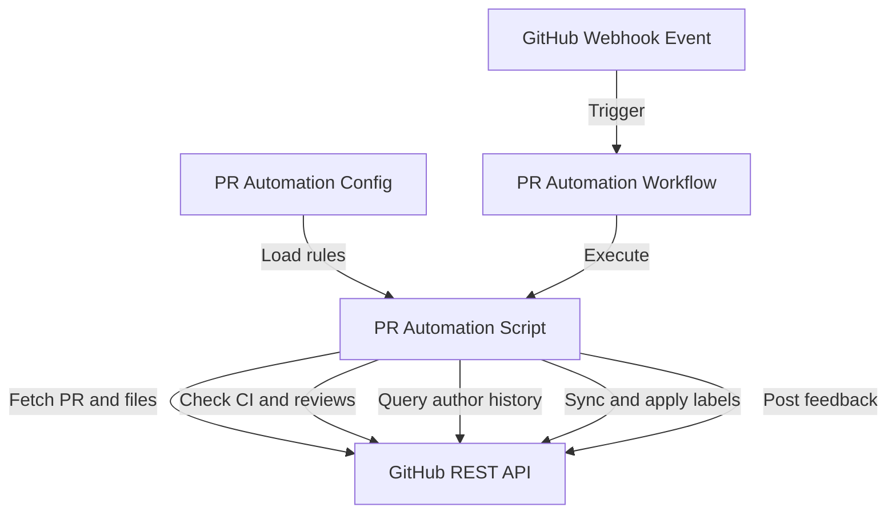

# Pull Request and Merge Policy

This document defines the strict quality gates, review processes, and configuration requirements for merging code into the `main` branch of **Birthday Bloom**.

---

## 1. Strict Merge Requirements

To maintain a professional-grade codebase and prevent accidental or unauthorized code changes:
- **No Automatic Merging**: Under no circumstances should pull requests be automatically merged by bots.
- **Maintainer Approval**: Every pull request requires explicit review and approval from a designated repository owner or administrator.
- **Codeowner Review**: Any changes affecting core directories (like `.github/` or `src/`) must be reviewed and approved by the owner specified in the `.github/CODEOWNERS` file.
- **CI Status Checks**: All automated quality checks, linting, type compilation, and unit tests must pass successfully before a pull request becomes eligible for merge.

---

## 2. GitHub Branch Protection Setup (Required Admin Actions)

Since branch protection rules cannot be configured directly via local codebase files, the repository administrator must apply the following settings in the GitHub repository settings page:

### Step-by-Step Instructions:

1. **Navigate to Settings**:
   Go to the repository homepage on GitHub, and click on the **Settings** tab.

2. **Open Branch Rules**:
   In the left sidebar, locate the **Code and automation** section and click on **Branches**.

3. **Add Protection Rule**:
   Click on the **Add branch protection rule** button. Or, if a rule for the `main` branch already exists, click **Edit**.

4. **Define Branch Pattern**:
   Set the **Branch name pattern** to `main` (or the default branch of the repository).

5. **Configure Pull Request Settings**:
   Check the box **Require a pull request before merging**.
   - Check **Require approvals** and set **Required number of approvals before merging** to at least `1`.
   - Check **Require review from Code Owners** (this ensures the users configured in `.github/CODEOWNERS` must approve).
   - Check **Dismiss stale pull request approvals when new commits are pushed** to ensure modifications are re-reviewed.

6. **Configure Status Checks**:
   Check the box **Require status checks to pass before merging**.
   - Check **Require branches to be up to date before merging**.
   - In the search box, find and select `Quality Checks` (this corresponds to the workflow job defined in `.github/workflows/ci.yml`).

7. **Resolve Conversations**:
   Check the box **Require conversation resolution before merging** to ensure all reviewer comments are addressed.

8. **Ensure Auto-Merge is Disabled**:
   Do **not** enable "Allow auto-merge" in the repository settings page under **Pull Requests** (or ensure it is disabled in the branch protection options).

9. **Save Changes**:
   Click **Create** or **Save changes** at the bottom of the page.

---

## 3. Pull Request Automation System

An automated triage system processes every pull request to enforce quality controls, classify changes, and provide real-time status feedback.

### Automation Workflow Architecture
The system is configuration-driven and runs a native Node.js agent to communicate with the GitHub REST API:

*Figure: The execution flow and API interactions of the PR automation system.*

### Automation Rules & Taxonomy

1. **Complexity Levels (`pr-level:*`)**:
   Automatically computed based on total lines modified (`additions + deletions`) and files changed:
   * **`pr-level:trivial`**: Typo fixes, `< 10` lines, `1` file.
   * **`pr-level:beginner`**: Simple patches, `< 50` lines, `≤ 3` files.
   * **`pr-level:intermediate`**: Standard component edits, `≤ 300` lines, `≤ 10` files.
   * **`pr-level:advanced`**: Large features or refactoring, `≤ 800` lines, `≤ 25` files.
   * **`pr-level:major`**: Broad changes, `> 800` lines or `> 25` files (triggers a warning to split the PR).

2. **Change Type Labels**:
   Inferred from conventional commit prefixes in the PR title first (e.g. `feat`, `fix`, `docs`, `refactor`, `chore`, `test`, `ci`, `style`, `perf`). If no prefix is present, it falls back to path-based scoring heuristics. These map directly to the unified project labels:
   * **`bug`**: Something isn't working or needs a fix.
   * **`enhancement`**: New feature or request.
   * **`documentation`**: Improvements or additions to documentation.
   * **`refactor`**: Refactoring code style, file structure, or performance.
   * **`chore`**: Routine tasks, maintenance, build tasks.
   * **`test`**: Adding or updating tests.
   * **`ci-cd`**: GitHub Actions, Vercel, Netlify, Docker configuration.
   * **`style`**: Changes that do not affect the meaning of the code.
   * **`performance`**: Performance regression or improvement.

3. **Affected Scope/Area Labels**:
   Tags the PR based on the files touched:
   * **`area:frontend`**: Changes to frontend/UI/UX components and styles.
   * **`area:core`**: Changes to core business logic, store, or services.
   * **`customization`**: Changes to templates, assets, or global configuration.
   * **`documentation`**: Changes to documentation files.
   * **`ci-cd`**: Changes to workflow configs or deployment setups.
   * **`test`**: Changes to test files.

4. **Real-Time Status Tracking (`status:*`)**:
   Labels update dynamically based on the PR's lifecycle stage:
   * **`status:draft`**: PR is in draft state.
   * **`status:needs-review`**: Ready for maintainers to review.
   * **`status:changes-requested`**: Blocked on review feedback changes.
   * **`status:approved`**: Approved by reviewers, waiting on checks/mergeability.
   * **`status:ready-to-merge`**: Fully approved, passing CI, and conflict-free.
   * **`status:merge-conflict`**: Has conflicts with `main` that must be resolved.
   * **`status:ci-failing`**: The CI quality suite has failing checks.

5. **Contributor Context**:
   Applies **`first-time-contributor`** if the author has no prior merged PRs, or **`returning-contributor`** if they do.

6. **Automated Feedback Dashboard**:
   A bot comment is posted and updated in-place on every PR, listing the change metrics table, flagging critical warnings (large PR, unrelated areas, merge conflicts, failing CI), and detailing the next-step instructions.

