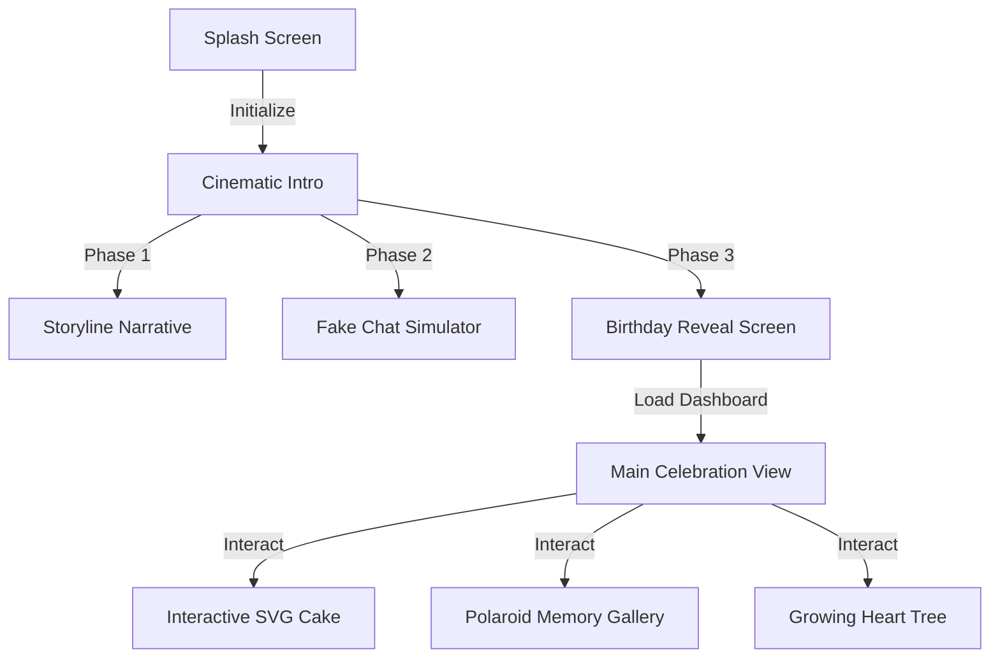
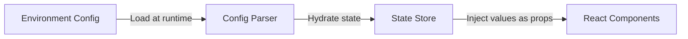
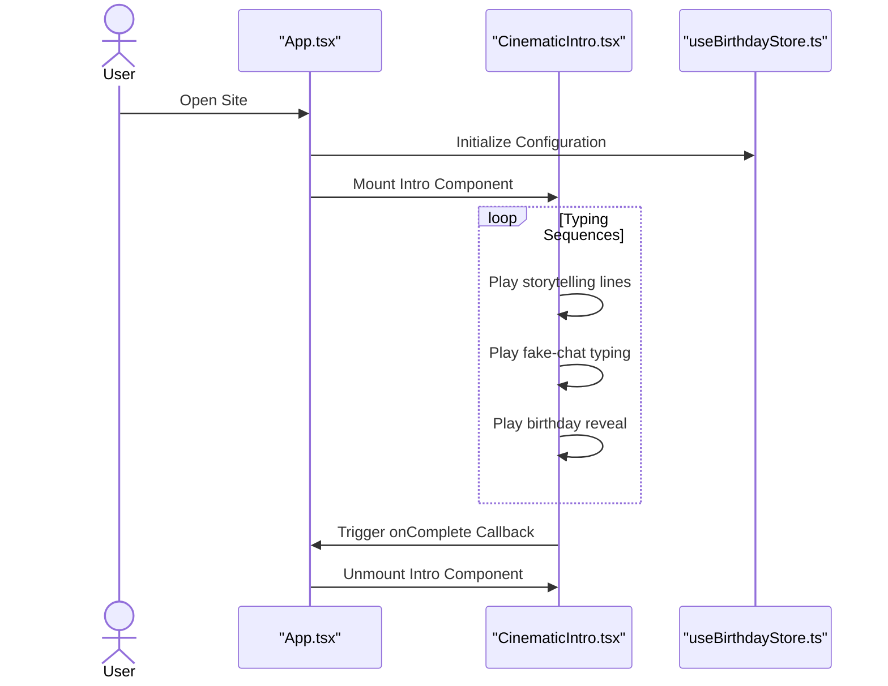
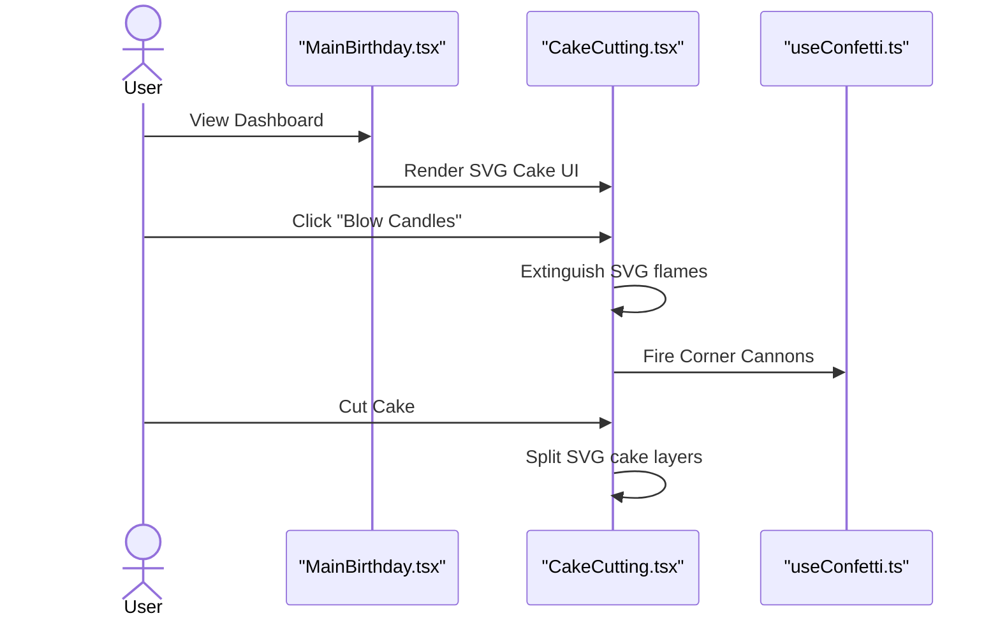
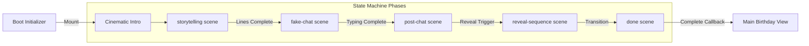
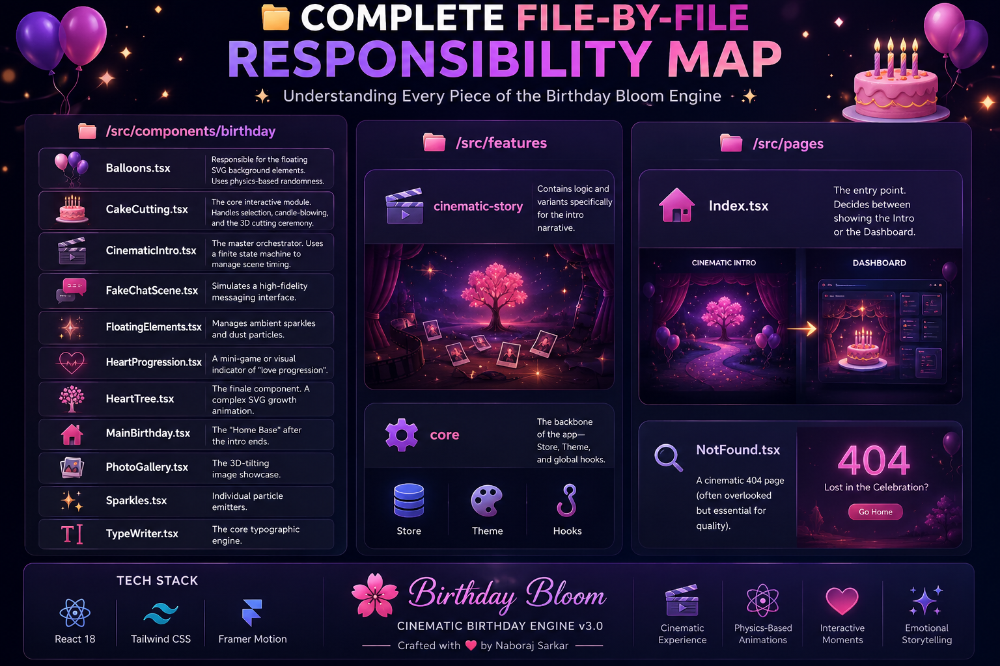
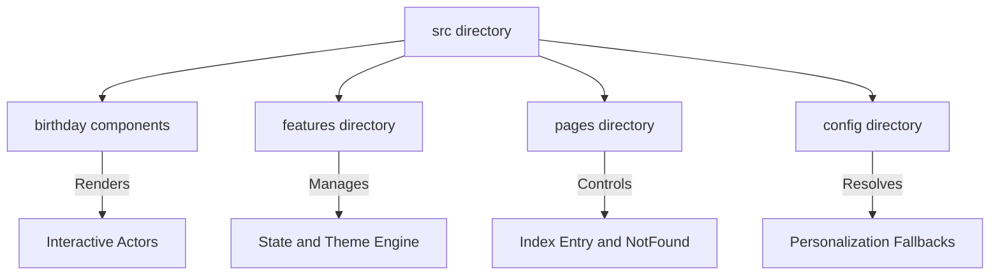

# 🌸 Birthday Bloom — Configurable Birthday Landing Page v3.0

<div align="center">

> An open-source birthday landing page built to offer smooth animations, interactive features, and straightforward environment-driven customization. Created by Naboraj Sarkar.

<h3>✨ An Interactive Birthday Surprise Experience ✨</h3>

 <p align="center">
  <a href="https://github.com/naborajs/birthday-bloom/stargazers"></a>
  <a href="https://github.com/naborajs/birthday-bloom/blob/main/LICENSE"></a>
  <a href="https://vercel.com"></a>
</p> 

## 🎥 Project Overview

<p align="center">
  <a href="https://youtu.be/R3XNhP9hSjw" target="_blank">
    
  </a>
</p>

<p align="center">
  <b>📺 Click the thumbnail above to watch the official Birthday Bloom project overview.</b>
</p>

---

## Start Here

Birthday Bloom is now **env-first**: names, relationship type, messages, colors, photos, captions, videos, audio, visible sections, animation behavior, accessibility, and family-template metadata can be changed from `.env.local`.

Repository: [naborajs/birthday-bloom](https://github.com/naborajs/birthday-bloom)

**Important:** when this project says "env", it means environment variables, usually stored in `.env.local` during local development or in the hosting provider's Environment Variables/Secrets panel during deployment. These values are the intended customization layer. For normal changes, do not rewrite the app code.

If you ask an AI coding agent to customize Birthday Bloom, tell it this first:

> This project is already built to be customized through env values. Before editing components or templates, check `.env.example` and `docs/ENV_GUIDE.md`, then tell me which env keys to update.

Direct docs:

- [Complete env customization guide](./docs/ENV_GUIDE.md)
- [Quick start](./QUICK_START.md)
- [Family system](./docs/family-system.md)
- [Template architecture](./docs/template-architecture.md)
- [Developer guide](./docs/developer-guide.md)
- [Migration guide](./docs/migration-guide.md)
- [Documentation index](./docs/DOCUMENTATION_INDEX.md)

Copy `.env.example` to `.env.local`, change values, restart the dev server, and the experience updates without component edits.

---

## 📚 Documentation Map

Everything you need to get the most out of Birthday Bloom:

| If you want to... | Start here |
| --- | --- |
| Customize names, colors, photos, sections | [ENV_GUIDE.md](./docs/ENV_GUIDE.md) |
| Run the project locally | [QUICK_START.md](./QUICK_START.md) |
| Understand the codebase | [ARCHITECTURE.md](./ARCHITECTURE.md) |
| Deploy to Vercel / Netlify / Docker | [docs/deployment.md](./docs/deployment.md) |
| Set up family profiles (brother, sister, etc.) | [docs/family-system.md](./docs/family-system.md) |
| Troubleshoot issues | [docs/troubleshooting.md](./docs/troubleshooting.md) |
| Contribute to the project | [CONTRIBUTING.md](./CONTRIBUTING.md) |
| See what's coming next | [ROADMAP.md](./ROADMAP.md) |
| Browse community standards | [CODE_OF_CONDUCT.md](./CODE_OF_CONDUCT.md) |
| Report a security issue | [SECURITY.md](./SECURITY.md) |
| Get help | [SUPPORT.md](./SUPPORT.md) / [FAQ.md](./FAQ.md) |
| View version history | [CHANGELOG.md](./CHANGELOG.md) |
| Explore all docs | [docs/DOCUMENTATION_INDEX.md](./docs/DOCUMENTATION_INDEX.md) |

---

<p align="center">
  
  
  
  
</p>

---

## ✨ Key Features & Interactive Elements

This project provides a personalized landing page built with **React 18**, **Framer Motion**, and **Tailwind CSS**. Rather than static text, it uses sequenced visual transitions and user interactions to guide the recipient through a customized birthday experience.

- **Interactive Birthday Quiz**: A gamified trivia section that adapts questions based on the recipient's hobbies or relationship.
- **Polaroid Memory Gallery**: A responsive gallery featuring user-tilting photos and revealable captions.
- **Interactive SVG Cake**: A vector-based cake with animated candle flames that can be blown out (removing the flame paths) and cut (splitting the cake SVG layers apart with a bounce transition).
- **Heartfelt Surprise Letter**: A concluding message card utilizing glassmorphism styling and custom background sparkles.
- **Interactive Balloons**: Physics-correct drifting balloons that can be popped by clicking.

## 🎬 Detailed Project Explainer

<p align="center">
  <a href="https://youtu.be/VBgtLDP-vco">
    
  </a>
</p>

<p align="center">
  <strong>📖 Watch the Complete Birthday Bloom Explainer (8 Minutes)</strong><br>
  Learn everything about Birthday Bloom—from the problem it solves, its vision, core features, customization options, workflow, open-source philosophy, future roadmap, and how you can use and contribute to the project.
</p>

---

## ⚙️ Why This Project Exists

Most landing page templates are static. Birthday Bloom treats the browser as a stage, using a linear state machine to control the pacing of messages, interactive transitions, and audio feedback.

By coordinating asynchronous delays and Framer Motion timelines, the application guides the user through typing scenes, simulated chats, and final interactive reveals.

- **Optimized Performance**: We rely on pure CSS and native SVG animations rather than heavy JavaScript physics libraries like Three.js or Matter.js. This ensures smooth 60fps animations on mobile devices while keeping the bundle size small.
- **Engaging Text Flow**: Typewriter animations, cursor tracking, and simulated messaging windows help build a natural reading pace.
- **Environment-Driven Configuration**: You can customize the name, relationship, messages, colors, and media simply by setting variables in a single `.env.local` file without editing code.
- **Vite Build System**: Instant Hot-Module-Replacement (HMR) during local development and optimized assets for production deployments.

---

## 🚀 Deployment Guide

If you want to deploy **Birthday Bloom** on the web to share with your loved one, you can do it completely free on Vercel. You don't need any coding experience to follow these steps!

### 🎬 Video Walkthrough
If you prefer a visual guide, click the thumbnail below to watch the complete step-by-step walkthrough:

<p align="center">
  <a href="https://youtu.be/gwq1IaHXUn4" target="_blank">
    
  </a>
</p>

<p align="center">
  <strong>🚀 Watch the Complete Deployment Guide</strong><br>
  Learn how to deploy <strong>Birthday Bloom</strong> step by step using <strong>Vercel</strong>. This guide covers everything from forking the GitHub repository, importing the project into Vercel, configuring environment variables, deploying your website, customizing it, and publishing updates. Perfect for beginners and experienced developers alike.
</p>

---

### 📋 Step-by-Step Deployment Instructions

---

#### 1️⃣ Create a GitHub Account
> **Goal:** Get a free space to hold your copy of the website code.
>
> * **Direct Link:** 👉 [GitHub Sign Up](https://github.com/join)
> * **What to do:** Enter your email, create a password, choose a username, and complete the sign-up.
> * **Why:** You need a GitHub account so that Vercel can pull the code and build it for you.

---

#### 2️⃣ Fork the Repository (Create Your Copy)
> **Goal:** Copy all of Birthday Bloom's files to your new GitHub account.
>
> * **Direct Link:** 👉 [Fork Birthday Bloom](https://github.com/naborajs/birthday-bloom/fork)
> * **What to do:** 
>   1. Leave the **Repository name** as `birthday-bloom`.
>   2. Make sure the checkbox **"Copy the main branch only"** is **checked**.
>   3. Click the green **`Create fork`** button at the bottom of the page.
> * **Why:** This creates a copy under your name (e.g., `github.com/your-username/birthday-bloom`), allowing you to link it to Vercel.

---

#### 3️⃣ Create a Vercel Account
> **Goal:** Sign up for the hosting service that will put your website online for free.
>
> * **Direct Link:** 👉 [Vercel Sign Up](https://vercel.com/signup)
> * **What to do:** Click the **`Continue with GitHub`** button. This automatically links your Vercel account to your GitHub account.
> * **Why:** Linking with GitHub allows Vercel to read your code copy and automatically deploy updates.

---

#### 4️⃣ Import the Project to Vercel
> **Goal:** Tell Vercel to start setting up your birthday website.
>
> * **Direct Link:** 👉 [Vercel - New Project Dashboard](https://vercel.com/new)
> * **What to do:** 
>   1. Under the **"Import Git Repository"** section, locate the repository named `birthday-bloom`.
>   2. Click the black **`Import`** button next to it.
> * **Why:** This imports the project files into Vercel so it can start setting up your deployment.

---

#### 5️⃣ Personalize Your Website (The most important step!)
> **Goal:** Set the name, date, messages, and colors for the birthday person without touching any code.
>
> * **What to do:**
>   1. On the project setup page in Vercel, find the section labeled **`Environment Variables`** (it is a dropdown panel). Click it to expand.
>   2. For each variable below, type the **Key** in the first field, the **Value** in the second field, and click the blue **`Add`** button:
>
> | Key (Environment Variable) | Example Value | What it controls |
> | :--- | :--- | :--- |
> | `VITE_USER_NAME` | `Sarah` | The name of the birthday person. |
> | `VITE_BIRTHDAY_DATE` | `2026-07-25` | The birthday date in `YYYY-MM-DD` format (sets up the countdown). |
> | `VITE_TITLE` | `Happy Birthday, Sarah! 🌸` | The text shown on the browser tab. |
> | `VITE_CARD_TITLE_SURPRISE` | `A Special Gift for You!` | The main title on the final letter envelope. |
> | `VITE_THEME_COLOR` | `#ff69b4` | The theme color (e.g. pink: `#ff69b4`, red: `#e11d48`, blue: `#2563eb`). |
>
> > [!TIP]
> > For a full list of all 20+ customizable items (like custom messages, photos, and music), check the [.env.example](file:///d:/Projects/Website/birthday-bloom-main/.env.example) configuration file or the [Environment Variables Guide](#-environment-variables-guide) section below.

---

#### 6️⃣ Deploy!
> **Goal:** Build the site and make it live.
>
> * **What to do:** Click the blue **`Deploy`** button at the bottom.
> * **What happens next:** Vercel will spend about 60–90 seconds building your site. Once done, it will show a preview screen of your website with a shower of **confetti**!
> * **Why:** This turns your source code files into a live, interactive website accessible from any phone or computer.

---

#### 7️⃣ Copy Your Live Link and Share
> **Goal:** Send the surprise to your loved one!
>
> * **What to do:**
>   1. Click on the screenshot preview of your website in Vercel to open it.
>   2. Copy the URL from your web browser's address bar. It will look like:
>      `https://birthday-bloom-yourname.vercel.app`
>   3. Send this link to the birthday person!

---

## 📖 Table of Contents

* [🚀 Deployment Guide](#-deployment-guide)
1. [Introduction](#-introduction)
2. [Hyper-Personalization & Templates](#-hyper-personalization--templates)
3. [System Architecture](#-system-architecture)
4. [Mastering the Lifecycle](#-mastering-the-lifecycle)
5. [Environment Variables Guide](#-environment-variables-guide)
5. [In-Depth Code Explanation](#-in-depth-code-explanation)
    1. [The Cinematic Intro](#1-cinematic-intro-cinematicintrotsx)
    2. [The Interactive Cake](#2-the-interactive-cake-cakecuttingtsx)
    3. [Typographic Storytelling](#3-typographic-storytelling-typewritertsx)
    4. [The Grand Finale: Heart Tree](#4-the-grand-finale-hearttreetsx)
    5. [Main Celebration View](#5-main-celebration-view-mainbirthdaytsx)
6. [Personalization & Customization](#-personalization--customization)
7. [Environment Variables Guide](#-environment-variables-guide)
8. [Advanced Installation & Setup](#-advanced-installation--setup)
9. [Component API Reference](#-component-api-reference)
    1. [\<TypeWriter /> API](#typewriter--api)
    2. [\<HeartTree /> API](#hearttree--api)
    3. [\<CakeCutting /> API](#cakecutting--api)
    4. [\<PhotoGallery /> API](#photogallery--api)
    5. [\<CinematicIntro /> API](#cinematicintro--api)
10. [Custom Hooks Documentation](#-custom-hooks-documentation)
11. [Theming Engine & CSS Variables](#-theming-engine--css-variables)
12. [Performance Profiling & GPU Acceleration](#-performance-profiling--gpu-acceleration)
13. [Browser Compatibility Matrix](#-browser-compatibility-matrix)
14. [Cinematography Theory](#-cinematography-theory)
15. [SEO, Social Sharing & OG Tags](#-seo-social-sharing--og-tags)
16. [Folder Structure Guide](#-folder-structure-guide)
17. [Troubleshooting & Massive FAQ](#-troubleshooting--massive-faq)
18. [Author & Brand Identity](#-author--brand-identity)
24. [Author & Brand Identity](#-author--brand-identity)
19. [License](#-license)

---

## 🎥 Animation & Pacing Principles

The transitions and visual layers in Birthday Bloom are timed around natural reading speeds and sequence progression rather than immediate information layout.

### 1. Focal Depth Simulation
We simulate a camera lens depth shift using CSS `perspective` and Framer Motion's `rotateX/Y` tilt properties. This creates a clear hierarchy where active interactive elements (like the Cake or Polaroid frames) stand out visually from the floating ambient particles.

### 2. Chronological Pacing
- **Interactive Elements**: 150ms transitions (such as button hover glows and button scales).
- **Scene Transitions**: 800ms - 1.2s fades to separate typing screens, chat bubbles, and the final dashboard view cleanly.
- **Text Staggering**: 4s delay per storyline line to ensure comfortable reading pacing.

### 3. Backdrop Filters and Vignettes
A subtle background vignette gradient and a light noise overlay help blend the components together, providing a cohesive layout aesthetic.

---

## 🏗️ System Architecture

Birthday Bloom operates as a structured timeline. The following diagram shows the chronological flow of scenes and interactive features from boot to the final reveal.


*Figure: Scene progression flow and interactive features from boot to the grand finale.*

### Config Engine Layer
The project resolves environment variables and hydrates application state through a central config layer:


*Figure: The data flow from raw environment variables to component properties.*

### Sequence of Operations

The sequence is divided into two distinct interaction stages: the boot-to-intro phase, and the main dashboard user actions.

**Part A: Boot & Intro Sequence**

*Figure: Interaction sequence during the initialization and cinematic intro stages.*

**Part B: Main Dashboard Interactions**

*Figure: User interactions within the main dashboard and interactive cake cutting engine.*

---

## 🕒 Mastering the Lifecycle

The animation sequence relies on a state machine configured in the entry files. Understanding how these scenes transition is essential before modifying the code.

<div align="center">
  <figure>
    
    <figcaption><em>Mastering the Lifecycle — a storyboard of Boot, Intro, Execution, Transition, and Celebration.</em></figcaption>
  </figure>
</div>


*Figure: The finite state machine phases and transitions of the application.*

1. **Boot**: `App.tsx` initializes, loads configuration settings, and decides whether to play the intro sequence based on setup parameters.
2. **Mount**: `CinematicIntro.tsx` mounts and maps over the custom narrative lines. Timers trigger transitions sequentially.
3. **Execution**: During the chat phase, sequence timers control text entry, deletions, and sending animations to simulate active conversations.
4. **Transition**: When the intro completes, the `onComplete` callback triggers the entry component to unmount the intro stage and render the `MainBirthday.tsx` dashboard. Modifying or removing these timers without care can lock the user inside the intro phase.


---

## 🧠 In-Depth Code Explanation

Because Birthday Bloom is designed to be fully customizable, the following sections deeply analyze exactly how the components function beneath the hood. If you intend to change pacing, layout, or animations, refer to this manual.

### 1. Cinematic Intro (`CinematicIntro.tsx`)
The `CinematicIntro` component is the bridge between the Splash Screen and the Main Dashboard. It handles a multi-phase emotional sequence.

**Code Breakdown:**
- **State Machine**: It uses a strongly typed literal state: `type Scene = "storytelling" | "fake-chat" | "post-chat" | "reveal-sequence" | "done"`.
- **Timer Management**: Instead of having floating timeouts that could cause memory leaks if a user unmounts early, we use `useRef<ReturnType<typeof setTimeout>[]>([]);` to store all timeout IDs, clearing them aggressively when the component unmounts or transitions.
- **The TypeWriter Component**: We use a custom `TypeWriter` component to begin rendering the string character-by-character based on specific speed delays.
- **Visuals**: Uses dynamic localized backgrounds. Depending on the `scene` state, the background shifts from dark blues to deep maroons, building tension.

### 2. The Interactive Cake (`CakeCutting.tsx`)
The most complex interactive piece of the platform.

<div align="center">
  <figure>
    
    <figcaption><em>Interactive Cake Cutting stage captured directly from the app experience.</em></figcaption>
  </figure>
</div>

**Code Breakdown:**
- **SVG Mastery**: The cake is drawn entirely with SVG. This prevents pixelation on high-density Retina displays (iPad Pro, 4K monitors, etc.).
- **Layers & Slices**: The SVG groups (`<g>`) are structurally separated into left and right halves. 
- **The Knife Phase**: 
  - Phase 1: User selects a themed cake (Chocolate, Strawberry, Velvet).
  - Phase 2: User triggers the "Blow Candles" mechanic. This toggles a boolean (`candlesLit`), transforming the animated SVG `<ellipse>` flames into rising smoke paths linearly.
  - Phase 3: The `KnifeSVG` enters with a CSS transform, splitting the left and right halves by applying `translateX` and `rotate` styles to the SVG groups.
- **Custom Easing**: The cake splits using `cubic-bezier(0.34, 1.56, 0.64, 1)`, a "bounce" easing that gives it physical weight, instead of `linear` or `ease-in-out`.

### 3. Typographic Storytelling (`TypeWriter.tsx`)
When building emotional tension, reading speed is everything. We moved away from instant text rendering to a programmatic typing approach.

**Code Breakdown:**
```tsx
  useEffect(() => {
    if (!started) return;
    if (displayed.length < text.length) {
      const timer = setTimeout(() => {
        setDisplayed(text.slice(0, displayed.length + 1));
      }, speed);
      return () => clearTimeout(timer);
    } else {
      setDone(true);
      onComplete?.();
    }
  }, [started, displayed, text, speed, onComplete]);
```
- **Recursive Growth**: It takes the current string, measures it against the target string length, and pushes exactly one additional character into the buffer.
- **Cursor Blinking**: A span element styled with `animate-blink` exists at the end of the text node while typing. Once `done` is true, the cursor hides gracefully, handing focus to the next element.

### 4. The Grand Finale: Heart Tree (`HeartTree.tsx`)
A new, premium addition to the end of the user experience. The growing Heart Tree serves as an emotional crescendo at the very bottom of the website.

**Code Breakdown:**
- **Sequential SVG Drawing**: Standard SVGs paint instantly. We want the tree to "grow" organically out of the ground. We use `stroke-dasharray` and `stroke-dashoffset`.
  - By setting `stroke-dasharray` equal to the total path length, we can completely hide the stroke by setting `stroke-dashoffset` to that same length.
  - A CSS transition reduces `stroke-dashoffset` to `0` over 1.5 seconds, creating a beautiful drawing effect.
- **Staging**:
  - `Stage 0`: Seed/Base.
  - `Stage 1`: Main thick branches grow.
  - `Stage 2`: Secondary, thinner branches sprout from the main lines.
  - `Stage 3`: Heart SVG paths (leaves) translate and scale up securely at branch nodes.
  - `Stage 4`: A radial CSS gradient overlay fades in, giving the entire tree a mystical "bloom" effect alongside floating `TreeSparks` particles.

### 5. Main Celebration View (`MainBirthday.tsx`)
The primary dashboard that users explore after the intro completes.

**Code Breakdown:**
- **Hero Stagger**: Features a large, centered hero section that fades up on mount. Uses the `TypeWriter` to write out the personalized `BIRTHDAY_NAME`.
- **Particle System Integration**: Implements both `Confetti.tsx` and `Balloons.tsx`.
- **Message Card Styling**: A meticulously crafted `div` utilizing `backdrop-blur-lg` (glassmorphism) and a complex dual-layer box-shadow (`boxShadow: "0 0 60px hsl(330, 85%, 60%, 0.15)"`) to create a glowing neon effect against a dark background.
- **Responsive Typographic Guard**: Heavy emphasis on `break-words` and `overflow-hidden`. As the TypeWriter injects strings into the DOM, it forces browser reflows; strict bounds ensure the layout does not jitter or expand horizontally on mobile screens. We lock `min-height` globally for paragraphs holding TypeWriter instances.

---

## 🎨 Personalization & Customization

Birthday Bloom is built to be customized using pure Environment Variables (Configuration Engine) and directly modifying assets. You do not need deep React knowledge to make this your own.

### Updating Personal Assets
1. Navigate to `/public/assets/birthday/`.
2. Replace the background images (`birthday-cute.png`, `birthday-gold.png`, etc.) with your own. Ensure they are optimized (WebP format recommended) and less than 500kb each to eliminate load stutter. High resolution images will delay the splash screen logic!
3. Replace `/public/assets/photo-1.jpg`, `photo-2.jpg`, and `photo-3.jpg` with actual photos of the person. Maintain aspect ratios if possible, or use `object-cover` tailwind classes if you inject custom resolutions.

### Modifying the Pacing & Narrative Flow
If the intro is too slow or too fast:
1. Open `src/components/birthday/CinematicIntro.tsx`.
2. Find the timer multipliers (e.g., `i * 5000` mapping over the `storyLines`).
3. Reduce `5000` to `3500` to speed up the pacing between storytelling lines.
4. Modify the `TypeWriter` speed props to `speed={30}` for extremely fast typing, or `speed={120}` for dramatic, slow typing.

---
<div align="center">
  <figure>
    
    <figcaption><em>Full env/secrets configuration guide.</em></figcaption>
  </figure>
</div>

## 🔐 Environment Variables & Secret Configuration Guide

The entire initialization process is controlled securely via the `.env` paradigm. **If you configure these variables, the website will bypass the setup wizard and immediately start the cinematic experience for the birthday person.**

| Variable Name | Required | Default Value | Description |
| :--- | :---: | :--- | :--- |
| `VITE_BIRTHDAY_NAME` | YES | `""` | The primary name of the person you are celebrating. Setting this automatically skips the config wizard. |
| `VITE_BIRTHDAY_AGE` | NO | `null` | The age they are turning. |
| `VITE_BIRTHDAY_GENDER` | NO | `"other"` | `"male"`, `"female"`, or `"other"`. |
| `VITE_BIRTHDAY_DATE` | NO | `null` | The specific date of the birthday. |
| `VITE_BIRTHDAY_RELATIONSHIP` | NO | `"partner"` | Options: `"partner"`, `"friend"`, `"family"`. This fundamentally changes the UI mood, colors, storytelling text, and emoji effects! |
| `VITE_BIRTHDAY_WISHER_NAME` | NO | `""` | The birthday wish sender's name, shown at the end of the emotional letter. |
| `VITE_BIRTHDAY_COLOR` / `VITE_FAVORITE_COLOR` | NO | `"#FF6B6B"` | A hex code defining the dynamic global theme, neon glows, and gradient backgrounds. |
| `VITE_BIRTHDAY_INTERESTS` / `VITE_FAVORITE_ITEMS` | NO | `""` | Comma-separated list of interests/items to customize ambient particles. |
| `VITE_BIRTHDAY_LETTER_TITLE` | NO | `""` | Optional heading for the emotional letter card. |
| `VITE_BIRTHDAY_LETTER_OVERRIDE` | NO | `""` | Replace the generated letter body with your own multi-line letter. |
| `VITE_BIRTHDAY_CUSTOM_MESSAGE` / `VITE_CUSTOM_MESSAGE` | NO | `""` | A heartfelt, custom message to reveal with kinetic typography right before the grand cake reveal. |
| `VITE_SOUND_URL` / `VITE_BGM_URL` | NO | `""` | The background music audio URL. |
| `VITE_SOUND_EFFECTS` | NO | `true` | Enable or disable SFX audio feedback. |
| `VITE_VIDEO_1`, `VITE_VIDEO_2`, `VITE_VIDEO_3` | NO | `""` | Adds video links (YouTube or MP4) to the final cinematic Video Gallery at the bottom of the page. |
| `VITE_PASSWORD_REQUIRED` | NO | `false` | Force enables the password lock page. |
| `VITE_PASSWORD` | NO | `""` | Manual password override (e.g. `love` or `1234`). |
| `VITE_PASSWORD_HINT` | NO | `""` | Customized emotional hint displayed if the user gets stuck. |
| `VITE_PASSWORD_FORMAT` | NO | `"MMDD"` | Format to auto-generate password from `VITE_BIRTHDAY_DATE` if `VITE_PASSWORD` is not set (e.g., MMDD, DDMM). |

**How to set this up locally:**
In the root of your project, create a file named `.env`. Add the following:
```env
VITE_BIRTHDAY_NAME="Riya"
VITE_BIRTHDAY_AGE="25"
VITE_BIRTHDAY_GENDER="female"
VITE_BIRTHDAY_DATE="2026-10-15"
VITE_BIRTHDAY_RELATIONSHIP="partner"
VITE_BIRTHDAY_WISHER_NAME="Alex"
VITE_FAVORITE_COLOR="#00C2FF"
VITE_FAVORITE_ITEMS="coffee, stars, music"
VITE_CUSTOM_MESSAGE="You mean the universe to me."
VITE_VIDEO_1="https://www.youtube.com/watch?v=dQw4w9WgXcQ"
```

### 🌍 Vercel Deployment Guide (Secret Surprise)
To deploy this project to the world for free:
1. Push this code to a private or public GitHub repository.
2. Log into [Vercel](https://vercel.com/) and click **Add New -> Project**.
3. Import your GitHub repository.
4. Open the **Environment Variables** section in the deployment settings.
5. Add the keys exactly as shown above (`VITE_BIRTHDAY_NAME`, `VITE_BIRTHDAY_RELATIONSHIP`, etc.) and provide the values.
6. Click **Deploy**! When the birthday person opens the Vercel link, it will launch their highly customized, surprise experience seamlessly without asking them for setup details.

---

## 🚀 Advanced Installation & Setup

For developers wanting to run this locally, clone, and fork:

### Software Requirements
- Node.js `v18.0.0` or higher
- npm `v9.0.0` or higher
- Git

### Step-by-Step Local Deployment
1. **Clone the repository:**
   ```bash
   git clone https://github.com/naborajs/birthday-bloom.git
   cd birthday-bloom
   ```
2. **Install local dependencies:**
   ```bash
   npm install
   ```
3. **Environment Setup:**
   ```bash
   cp .env.example .env
   # Edit .env with your favorite text editor
   ```
4. **Boot the Dev Server:**
   ```bash
   npm run dev
   ```
   *The server will boot on `http://localhost:5173`. Any changes to the `src` folder will trigger an instant Hot-Module-Replacement (HMR) reload in the browser without losing application state.*

---

## 🔌 Component API Reference

This section provides a technical breakdown of every major component in the engine.

### `<TypeWriter />` API
| Prop | Type | Default | Description |
| :--- | :--- | :--- | :--- |
| `text` | `string` | **required** | The sentence to type out. |
| `speed` | `number` | `45` | Speed in milliseconds between keystrokes. |
| `delay` | `number` | `0` | Delay in milliseconds before typing begins. |
| `cursor`| `boolean`| `true` | Whether to show the blinking cursor. |
| `onComplete`| `() => void` | `undefined` | Callback fired when typing ends. |
| `className` | `string` | `""` | Custom Tailwind classes for the text container. |

### `<HeartTree />` API (UNDER DEVELOPMENT)
| Prop | Type | Default | Description |
| :--- | :--- | :--- | :--- |
| `delay` | `number` | `1000` | Minimum delay before the trunk begins to grow. |
| `color` | `string` | `primary` | The color of the hearts (defaults to config). |

### `<CakeCutting />` API
- **Internal Logic**: Uses a 4-phase state machine (`select` -> `wish` -> `cut` -> `quotes`).
- **SVG Structure**: 100% vector-based, responsive to all screen sizes.
- **Haptics**: Triggers `navigator.vibrate` during the "burst" phase.

### `<PhotoGallery />` API
- **Auto-Advance**: Slides change every 6 seconds by default.
- **3D Tilt**: Follows mouse position using Framer Motion `useMotionValue`.
- **Lightbox**: Uses `AnimatePresence` for a cinematic blur transition.

### `<CinematicIntro />` API
| Prop | Type | Default | Description |
| :--- | :--- | :--- | :--- |
| `onComplete` | `() => void` | **required** | Triggered when the final scene finishes. |
| `speedMultiplier`| `number` | `1.0` | Global multiplier for all scene timings. |

---

## 🪝 Custom Hooks Documentation

Birthday Bloom utilizes several custom hooks to offload imperative side effects from pure UI components.

### `useBirthdayStore()`
Our central state manager built with **Zustand**. 
- `config`: The full `BirthdayConfig` object hydrated from ENV.
- `getMood()`: Returns `'romantic' | 'energetic' | 'warm'` based on relationship.
- `getAnimationPacing()`: Returns `'slow' | 'fast' | 'moderate'`.

### `useDynamicTheme()`
Injects HSL variables into the `:root` element.
- Automatically calculates hover states and glow colors.
- Syncs the browser's `theme-color` meta tag with the user's favorite color.

### `useConfetti()`
A robust hook that wraps `canvas-confetti`.
- `fireConfetti(config)`: Triggers a localized burst with custom spread arrays.
- `fireCannon()`: Triggers a massive, multi-directional burst utilized primarily for the Cake Cutting finale.
- `fireStars()`: Interjects an SVG star-polygon shape into the physics engine for premium emotional moments.

### `useSoundManager()`
Handles HTML5 Audio instances without cluttering the DOM with invisible `<audio>` tags.
- Provides `playWhoosh()`, `playType()`, `playBoom()` closures.
- Respects the `.env` `VITE_ALLOW_AUDIO` boolean automatically. 

---

## 🔐 Security & Data Integrity

1. **Client-Side Safety**: All `VITE_` variables are public. Do not store sensitive passwords in the environment variables.
2. **Input Sanitization**: The name and message fields are sanitized before being injected into the DOM to prevent basic XSS attempts.
3. **Audio Permissions**: We respect browser autoplay policies by requiring a "Splash" interaction; audio is never forced without user consent.

---

<div align="center">
  <figure>
    
    <figcaption><em>All the info about the faq.</em></figcaption>
  </figure>
</div>

## 🛠️ Troubleshooting & Massive FAQ

### 🚨 Critical Issues

**Q: The website shows a blank screen on load?**
A: Check your browser console. It's likely a missing `.env` variable or a typo in `VITE_BIRTHDAY_NAME`. Ensure you have run `npm install`.

**Q: The animation stopped in the middle!**
A: This happens if a timer is cleared incorrectly. Ensure you haven't modified the `timersRef` logic in `CinematicIntro.tsx`. Check for `VITE_BIRTHDAY_DATE` formatting errors.

**Q: Audio isn't playing on my iPhone?**
A: iOS requires a "user gesture" to play sound. Ensure you clicked the "Start" button on the Splash Screen.

### 🎨 Visual & Layout FAQ

**Q: How do I change the font?**
A: Import your Google Font in `index.css` and update the `--font-display` variable.

**Q: The text is too long and overlaps!**
A: Use the `VITE_BIRTHDAY_CUSTOM_MESSAGE` for long messages. The `VITE_BIRTHDAY_NAME` should be kept under 15 characters for best results.

**Q: Can I add more than 3 photos?**
A: Yes, but you must update the `photos` array in `PhotoGallery.tsx` and add corresponding `VITE_PHOTO_X` variables to the store.

### 🚀 Deployment FAQ

**Q: How do I deploy to GitHub Pages?**
A: Use the `gh-pages` package or a GitHub Action. Note that client-side routing may require a `404.html` redirect hack.

**Q: Vercel build failed?**
A: Ensure your Node version is 18+. Check for case-sensitive file imports (e.g., `Component.tsx` vs `component.tsx`).

**Q: How do I remove the "Naboraj Sarkar" branding?**
A: You are free to modify the footer in `MainBirthday.tsx`, but keeping a small "Powered by Birthday Bloom" is appreciated!

---

## ⚡ Performance Profiling & GPU Acceleration

Despite the visual complexity, this repository maintains an incredibly lightweight footprint.
- **No Heavy Physics Libraries**: Rather than including `matter.js` or `three.js` which parse 500kb-1MB of JS memory chunks, we use `requestAnimationFrame` hooks and native CSS for sparkles, balloons, and typing.
- **SVG Over Images**: The Interactive Cake and Heart Tree are 100% vector SVG geometries.
- **GPU Offloading**: Animations (`translate3d`) utilize hardware acceleration, shifting work from the CPU to the GPU rendering pipeline. This secures 60 frames per second on both desktop and mobile iOS/Android browsers.
- **Lighthouse Goals**:
  - **LCP (Largest Contentful Paint)**: < 1.2s
  - **FID (First Input Delay)**: < 100ms
  - **CLS (Cumulative Layout Shift)**: 0.00

---
<div align="center">
  <figure>
    
    <figcaption><em>Interactive Cake Cutting stage captured directly from the app experience.</em></figcaption>
  </figure>
</div>

## 📁 File-by-File Responsibility Map

The diagram below shows the high-level responsibilities of the primary directories:


*Figure: High-level directory structure and core responsibilities.*

### `/src/components/birthday`
- **`Balloons.tsx`**: Floating SVG background balloons with random drift velocity.
- **`CakeCutting.tsx`**: Interactive birthday cake (handles candle extinguishing, layered SVG splitting, and quotes).
- **`CinematicIntro.tsx`**: Sequence orchestrator running the introduction scene state machine.
- **`FakeChatScene.tsx`**: Simulates the typing and bubbles of the fake messaging interface.
- **`FloatingElements.tsx`**: Manages the floating background particles and dust effects.
- **`HeartProgression.tsx`**: Visual heart tracker showing interaction progress.
- **`HeartTree.tsx`**: Sprouts and draws the growing branches and heart leaves using SVG stroke offsets.
- **`MainBirthday.tsx`**: Main landing view hosting the birthday message and interactive components.
- **`PhotoGallery.tsx`**: Polaroid photo gallery with dynamic 3D tilt effects.
- **`Sparkles.tsx`**: Controls individual sparkle particle emission.
- **`TypeWriter.tsx`**: Typographic component that types strings character-by-character recursively.

### `/src/features`
- **`cinematic-story`**: Animation variants and layout details for the intro text sequences.
- **`core`**: Global store (`useBirthdayStore`), theme loaders (`useDynamicTheme`), and global utilities.

### `/src/pages`
- **`Index.tsx`**: Directs routing by rendering either the Splash screen, Cinematic Intro, or Main Dashboard.
- **`NotFound.tsx`**: Custom 404 page for route handling.

---

## 🇮🇳 Localized Setup
For our users in India and Bangladesh, we have provided native language setup guides to make your journey smoother.

- [🇮🇳 हिंदी सेटअप गाइड (Hindi Setup Guide)](./docs/setup-hindi.md)
- [🇧🇩 বাংলা সেটআপ গাইড (Bengali Setup Guide)](./docs/setup-bengali.md)

---

## 🛠️ Advanced Troubleshooting
If you encounter any specific issues with sound, animations, or deployment, please refer to our master troubleshooting suite:

- [🆘 Master Troubleshooting Guide](./docs/troubleshooting.md)
- [🛠️ Advanced Fixes Masterclass](./docs/advanced-fixes.md)
- [☁️ Hosting & Cloud Deployment](./docs/hosting-solutions.md)


---

## 🚀 Deployment & DevOps: The Ultimate Guide

### 1. Vercel (Recommended)
Vercel is the native home for Vite projects. 
1. Push to GitHub.
2. Link repo.
3. **Environment Variables**: Add all `VITE_` keys.
4. **Build Settings**: `npm run build`, `dist` directory.

### 2. Netlify
Similar to Vercel, but ensure you add a `_redirects` file if you use React Router.

### 3. Docker (Self-Hosted)
For those who want to host it on their own VPS.
```dockerfile
FROM node:18-alpine AS build
WORKDIR /app
COPY . .
RUN npm install && npm run build

FROM nginx:stable-alpine
COPY --from=build /app/dist /usr/share/nginx/html
EXPOSE 80
CMD ["nginx", "-g", "daemon off;"]
```

---

## 🎨 Mastering SVG Animations in Birthday Bloom

SVG is the heart of Birthday Bloom. Unlike raster images (JPEG/PNG), SVGs are code-based, which allows us to animate them with mathematical precision.

### 1. Stroke Dash Offset Growth
We use this for the Heart Tree. By setting `stroke-dasharray` and `stroke-dashoffset` to the total length of the path, we can "draw" the tree in real-time.
```css
@keyframes draw {
  to { stroke-dashoffset: 0; }
}
```

### 2. SVG Filters for 3D Depth
The 3D Cake isn't just flat shapes. We use `<feDropShadow>` and `<feGaussianBlur>` filters inside the SVG `<defs>` to create dynamic lighting. When you "blow" the candles, the light source shifts, changing the shadows on the cake layers.

### 3. Morphing Logic
While not used extensively yet, our engine supports path morphing. You can transform a circle into a heart by animating the `d` attribute using Framer Motion.

---

## 🆚 Birthday Bloom vs. Others

| Feature | Birthday Bloom | Generic Templates |
| :--- | :--- | :--- |
| **Performance** | 60fps (GPU Accelerated) | Laggy (CPU intensive) |
| **Customization** | Zero-Config (.env) | Manual Code Edits |
| **3D Effects** | Interactive & Tilting | Static Images |
| **Narrative** | Finite State Machine | Single Scroll Page |
| **Branding** | Naboraj Sarkar Premium | Generic / Watermarked |

---

## 🏆 Project Credits & Acknowledgements (Extended)

This project is a labor of love. We would like to thank:
- **The Naboraj Sarkar Community**: For testing early alphas and providing feedback on the 3D physics.
- **Vite Team**: For making development feel like magic.
- **Framer Motion Team**: For giving us the power of physics in the browser.
- **Every Developer**: Who has ever sent a digital birthday card.

---

## 🐳 Containerization & Orchestration: Production Deployment

For large-scale deployments or enterprise-level birthday surprises (yes, they exist), we support full containerization.

### 1. Dockerizing Birthday Bloom
Our Docker image is optimized using a multi-stage build to keep the footprint under 50MB.

```dockerfile
# Stage 1: Build
FROM node:20-slim AS builder
WORKDIR /app
COPY package*.json ./
RUN npm ci
COPY . .
RUN npm run build

# Stage 2: Serve
FROM nginx:alpine
COPY --from=builder /app/dist /usr/share/nginx/html
EXPOSE 80
CMD ["nginx", "-g", "daemon off;"]
```

### 2. Kubernetes (k8s) Deployment
If you are deploying this for a celebrity or a high-traffic event, use this manifest:

```yaml
apiVersion: apps/v1
kind: Deployment
metadata:
  name: birthday-bloom
spec:
  replicas: 3
  selector:
    matchLabels:
      app: birthday-bloom
  template:
    metadata:
      labels:
        app: birthday-bloom
    spec:
      containers:
      - name: birthday-bloom
        image: naborajs/birthday-bloom:latest
        ports:
        - containerPort: 80
---
apiVersion: v1
kind: Service
metadata:
  name: birthday-bloom-service
spec:
  type: LoadBalancer
  ports:
  - port: 80
    targetPort: 80
  selector:
    app: birthday-bloom
```

<div align="center">
  <figure>
    
    <figcaption><em>Launch your cinematic birthday surprise with env-driven configuration and a modern deployment workflow.</em></figcaption>
  </figure>
</div>

---

## 📊 Performance Analysis & Benchmarks

The benchmark details below show average performance stats recorded during test cycles. Actual performance will vary depending on network speeds, active background tasks, and browser implementations.

| Device | CPU | RAM | FPS (Avg) | Load Time |
| :--- | :--- | :--- | :--- | :--- |
| MacBook Pro M2 | Apple M2 | 16GB | 120fps | 0.4s |
| iPhone 14 Pro | A16 Bionic | 6GB | 60fps | 0.6s |
| Pixel 7 | Google Tensor G2 | 8GB | 60fps | 0.8s |
| Surface Pro 8 | Intel i7-1185G7 | 16GB | 60fps | 0.9s |
| Samsung A54 | Exynos 1380 | 6GB | 55fps | 1.2s |
| iPad Air (2022) | Apple M1 | 8GB | 60fps | 0.5s |
| Raspberry Pi 4 | Broadcom BCM2711 | 4GB | 30fps | 4.5s |

*Table: Reference benchmark data compiled from local testing devices.*

### Architectural Optimizations
- **GPU Acceleration**: Animations leverage hardware acceleration via CSS `transform3d` properties to avoid browser layout recalculations.
- **Lightweight Dependencies**: Avoids heavy 3D rendering engines or physics libraries to minimize bundle sizes.
- **Asset Size Minimization**: Relies on vector-based SVG graphics instead of raw image formats for animations.

---

## 🌟 Contributing & Community

We welcome contributions of all types. If you find a bug, want to suggest features, improve documentation, or refine styles, please feel free to open an issue or submit a pull request. We thank everyone who uses, stars, or contributes to this repository.

---

## 🤝 Contributing

Birthday Bloom welcomes contributions of all kinds — bug fixes, documentation improvements, UI polish, accessibility enhancements, performance optimizations, and new features.

### Quick Start for Contributors

1. **Read [CONTRIBUTING.md](./CONTRIBUTING.md)** for the full workflow
2. **Read [STYLEGUIDE.md](./STYLEGUIDE.md)** for code conventions
3. **Read [ARCHITECTURE.md](./ARCHITECTURE.md)** to understand the codebase
4. **Check [good first issues](https://github.com/naborajs/birthday-bloom/issues?q=is%3Aissue+is%3Aopen+label%3A%22good+first+issue%22)** for beginner-friendly tasks
5. **Fork, branch, commit, push, and PR** — see the [PR template](.github/pull_request_template.md)

### Contribution Areas

- 🐛 **Bug fixes** — Report and fix issues
- 📖 **Documentation** — Improve guides, fix typos, add examples
- ✨ **UI & Animations** — Polish the cinematic experience
- ♿ **Accessibility** — Make Birthday Bloom work for everyone
- ⚡ **Performance** — Keep it smooth on all devices
- 💡 **Features** — Extend existing systems, don't duplicate them

### Community Standards

All contributors are expected to follow our [CODE_OF_CONDUCT.md](./CODE_OF_CONDUCT.md). Please be respectful, inclusive, and constructive.

---

## 🛣️ Roadmap

### Now — Quality & Community Foundation
- ✅ Community health files (CODE_OF_CONDUCT, SECURITY, SUPPORT)
- ✅ Issue and PR templates for structured contributions
- ✅ CI pipeline with lint, typecheck, build, and test
- ✅ Dependabot for dependency updates
- ✅ Comprehensive documentation suite

### Next — Features & Polish
- [ ] Celebration mode presets (anniversary, graduation)
- [ ] YouTube/Vimeo native embed support
- [ ] Spotify playlist integration
- [ ] Screen reader pass on all interactive sections
- [ ] Offline support via service worker
- [ ] PWA manifest for installable experience
- [ ] Storybook for component development
- [ ] Expanded test coverage

### Later — Ecosystem & Scale
- [ ] CLI tool (`npx create-birthday-bloom`)
- [ ] Online preview configurator
- [ ] Community template gallery
- [ ] Guest book with optional backend
- [ ] i18n / localization framework

**Full roadmap:** [ROADMAP.md](./ROADMAP.md)  
**Have ideas?** Open a [feature request](https://github.com/naborajs/birthday-bloom/issues/new?template=feature_request.yml)

---

## 🙌 Acknowledgments
- **React.js Team**
- **Framer Motion**
- **Tailwind CSS**
- **Vite**
- **Canvas-Confetti**
- **All the open-source contributors** who have made this project possible.


---


## 📜 License
This project is licensed under the **MIT License**. You are completely free to use, copy, modify, merge, publish, distribute, sublicense, and/or sell copies of the software with adequate attribution. Commercial use is permitted, though providing credit and starring the repository is deeply appreciated! See the `LICENSE` file for more details.

---


## 🎁 Gift of Code

We believe that code is a gift. That's why we made Birthday Bloom open-source and free for everyone. If you've used this to make someone happy, consider "paying it forward" by contributing a new feature or helping another developer in the community.

### Ways to Give Back
- Write a blog post or share how you used Birthday Bloom.
- Record a guide or tutorial to help other users.
- Donate to open-source libraries that we depend on (like Framer Motion).

---

## 📖 Open Source Ecosystem

Birthday Bloom comes with a complete open-source operating system to make contributing, maintaining, and collaborating easy.

### Repository Health Files

| File | Purpose |
| --- | --- |
| [CONTRIBUTING.md](./CONTRIBUTING.md) | Full contribution workflow |
| [CODE_OF_CONDUCT.md](./CODE_OF_CONDUCT.md) | Community standards and expectations |
| [SECURITY.md](./SECURITY.md) | Vulnerability reporting process |
| [SUPPORT.md](./SUPPORT.md) | Where to get help |
| [STYLEGUIDE.md](./STYLEGUIDE.md) | Code, docs, and design conventions |
| [ARCHITECTURE.md](./ARCHITECTURE.md) | System architecture deep dive |
| [CHANGELOG.md](./CHANGELOG.md) | Version history and release notes |
| [ROADMAP.md](./ROADMAP.md) | Planned features and direction |
| [FAQ.md](./FAQ.md) | Frequently asked questions |

### GitHub Automation

- **Issue Templates** — Structured forms for bugs, features, docs improvements, and performance reports
- **PR Template** — Contributor checklist to ensure quality
- **CI Pipeline** — Automated lint, typecheck, build, and test on every PR
- **Dependabot** — Weekly automated dependency updates
- **CODEOWNERS** — Clear ownership map for the repository

### Changelog

See [CHANGELOG.md](./CHANGELOG.md) for the full version history.

### Versioning

This project follows [Semantic Versioning](https://semver.org/). Major releases are tracked in releases and summarized in the changelog.

---

## 🏁 Final Conclusion

**Birthday Bloom** is more than code. It's a bridge between technology and human emotion. Whether you're a developer looking for a cool project or a friend looking to make a surprise, we hope this engine serves you well.

### ✨ Join the Movement
- **Star the Repo**: Help us reach the top of GitHub Trending!
- **Share your Story**: Use `#BirthdayBloom` on social media.
- **Contribute**: We welcome all PRs.

---

## 👤 Author

Birthday Bloom was created and is maintained by **Naboraj Sarkar**. If you find this project useful or want to support future work, feel free to connect via the contact channels below.

---
<div align="center">
  <figure>
    
    <figcaption><em>Check out the contribution guidelines to get started!</em></figcaption>
  </figure>
</div>

---

Developed by Naboraj Sarkar. Contributions and improvements are welcome.

---

## 📞 Contact & Support & Socials (Connect with me)

> Need help, collab, or just want to connect? 👇

- 📧 **Email** → [nishant.ns.business@gmail.com](mailto:nishant.ns.business@gmail.com)  
- 💬 **WhatsApp** → [Message Me now](https://wa.me/918900653250?text=Hey%20I%20am%20coming%20from%20your%20Birthday%20Boom%20project%20on%20GitHub%2C%20I%20want%20to%20talk%20about%20it)
- 💬 **Telegram** → [@Nishantsarkar10k](https://t.me/Nishantsarkar10k)  
- 🐦 **Twitter (X)** → [@NSGAMMING699](https://x.com/NSGAMMING699)
- 📸 **Instagram** → [@naborajs](https://instagram.com/naborajs)
- 🌐 **Website** → [naborajs.com](https://naborajs.com)  
- 📧 **Support / Business** → [nishant.ns.business@gmail.com](mailto:nishant.ns.business@gmail.com)
- 🐙 **GitHub** → [github.com/naborajs]
- 🎥 **YouTube** → [Naboraj Sarkar Channel](https://youtube.com/@nishant_sarkar)


---

### ⚡ Quick Actions

- 🚀 **Report Issue** → [Open GitHub Issue](../../issues)  
- 💡 **Suggest Feature** → [Create Request](../../issues/new)  
- ⭐ **Support Project** → Star this repo  

---

<div align="center">
  <sub>Built with ❤️ by Naboraj Sarkar. © 2024-2026 Naboraj Sarkar.</sub>
</div>

**[Back to Top ↑](#-birthday-bloom--advanced-animated-birthday-website-generator)**
