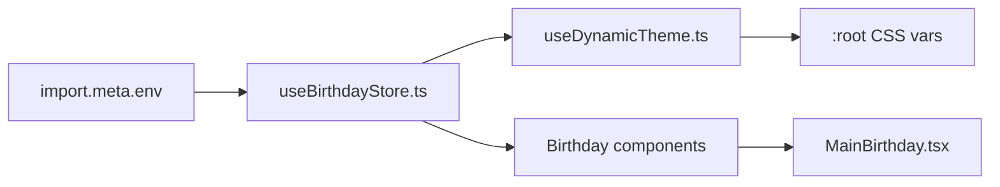

# 🏛️ Birthday Bloom Architecture: Runtime, Themes, and Cinematic Flow

Birthday Bloom is built as an **env-first cinematic runtime**: data is hydrated from environment variables, transformed into a typed app state, and rendered through a phase-driven animation pipeline.

This document explains the actual implementation layers, the live source files, and the runtime behavior that matters for extension and debugging.

---

## 🧩 Three core runtime layers

### 1. Data Layer — Env to Store
**File:** `src/features/core/store/useBirthdayStore.ts`

This is the single source of truth for personalization.

- It parses environment variables at module load time
- It normalizes aliases like `VITE_FAVORITE_COLOR` and `VITE_WISHER_NAME`
- It enforces safe fallback rules for malformed values
- It creates a typed `BirthdayConfig` object consumed by components

**Implementation highlights**:
- `parseEnvString()` drops empty values and normalizes `undefined` / `null`
- `parseEnvBoolean()` supports `true`, `false`, `1`, `0`, `yes`, `no`, `on`, `off`, `enabled`, `disabled`
- `parseEnvList()` accepts comma, pipe, newline, or JSON array formats
- `parseEnvJson<T>()` enables full JSON profile config via `VITE_FAMILY_PROFILE_JSON`

**Live runtime values** parsed by the store include:
- `VITE_BIRTHDAY_NAME`, `VITE_BIRTHDAY_AGE`, `VITE_BIRTHDAY_GENDER`, `VITE_BIRTHDAY_DATE`
- `VITE_BIRTHDAY_RELATIONSHIP` with alias normalization
- `VITE_BIRTHDAY_COLOR`, `VITE_BIRTHDAY_CUSTOM_MESSAGE`, `VITE_BIRTHDAY_LETTER_OVERRIDE`
- `VITE_PHOTOS`, `VITE_PHOTO_1..6`, `VITE_PHOTO_CAPTIONS`
- `VITE_VIDEO_1..3`, `VITE_FINAL_VIDEO_URL`
- `VITE_SPECIAL_MEMORIES`
- `VITE_PASSWORD`, `VITE_PASSWORD_HINT`, `VITE_PASSWORD_FORMAT`, `VITE_PASSWORD_REQUIRED`
- `VITE_FAMILY_PROFILE_JSON`, `VITE_FAMILY_MEMBER_TYPE`, plus family metadata vars

> Note: Some env keys appear in `.env.example` for future compatibility, but are not currently parsed in `useBirthdayStore.ts`. Those include `VITE_THEME`, `VITE_REDUCED_MOTION`, `VITE_TEXT_SIZE`, `VITE_HIGH_CONTRAST`, and `VITE_SHOW_SKIP_BUTTON`.

---

### 2. Theme Layer — Runtime CSS tokens
**File:** `src/features/core/theme/useDynamicTheme.ts`

This hook converts `favoriteColor`, `relationship`, and `gender` into `:root` variables.

It dynamically sets:
- `--color-primary`
- `--color-primary-low`
- `--color-primary-glow`
- `--bg-gradient`
- `--glow-effect`
- `--glass-opacity`
- `--font-display`
- `--animation-pacing`
- `--particle-speed`
- `--card-radius`
- gender-aware glow and blur adjustments

This layer keeps visual theming centralized and decoupled from presentational components.

---

### 3. Execution Layer — Phase machine and scenes
**Files:** `src/pages/Index.tsx`, `src/components/birthday/CinematicIntro.tsx`

The app is a finite-state experience with four exclusive phases:

- `splash`
- `unlock` (conditional on `isPasswordRequired(config)`)
- `intro`
- `main`

`Index.tsx` renders one phase at a time with `AnimatePresence`.
`CinematicIntro.tsx` manages a second-level storytelling timeline that runs the intro scenes in sequence.

**Phase transitions**:
- `SplashScreen` → checks password requirement
- `PasswordUnlock` → on success moves to `intro`
- `CinematicIntro` → when complete moves to `main`
- `MainBirthday` → final interactive dashboard with ambient layers

**Implementation truth**:
- A skip button exists in the UI, but it is not controlled by a runtime env toggle.
- The password screen appears when `VITE_PASSWORD_REQUIRED=true` or `VITE_PASSWORD` is present.
- The explicit phase values are typed as `type Phase = "splash" | "unlock" | "intro" | "main"`.

---

## 🔧 Actual data flow

---

## 🛡 Runtime resilience and behavior

Birthday Bloom is designed to avoid blank or broken screens.

- Invalid relationship strings fall back to `family`
- Invalid or missing dates are ignored, not thrown
- The app never reads `process.env`; it uses Vite's `import.meta.env` only
- All intro timers are tracked and cleared on component unmount
- The password generator uses either `VITE_PASSWORD` or the parsed birthday date

**Password rules**:
- supported formats: `MMDD`, `DDMM`, `YYYYMMDD`, `YYYY-MM-DD`, `MM-DD`, `DD-MM`, `YYYY`
- if `VITE_PASSWORD` is set, it overrides date generation
- if no password is provided and no date exists, password unlock is inactive

---

## 📂 Source file map

| File | Purpose |
| --- | --- |
| `src/features/core/store/useBirthdayStore.ts` | env parsing, typed config, helper accessors |
| `src/features/core/theme/useDynamicTheme.ts` | runtime CSS variable injection |
| `src/pages/Index.tsx` | top-level phase state machine and ambient layers |
| `src/components/birthday/MainBirthday.tsx` | main celebration dashboard |
| `src/components/birthday/CinematicIntro.tsx` | intro timeline and reveal sequence |
| `src/components/birthday/PasswordUnlock.tsx` | optional passcode gate |
| `src/utils/password.ts` | password generation / requirement logic |
| `src/config/birthday.ts` | legacy audio/photo fallback lookup |

---

## ✨ Animation and interaction system

Birthday Bloom uses Framer Motion with a cinematic orchestration approach.

### Animation patterns in use
- `AnimatePresence` for mounting/unmounting phase transitions
- `motion.div` with `opacity`, `scale`, `blur`, and `filter` transitions
- spring-based motion for natural feel
- staggered animation timing to preserve readability
- layered ambient effects for visual depth

### Key effects
1. Depth shift and blur transitions
2. 3D perspective rotations
3. staggered child animations
4. spring-based text reveals
5. emoji and particle bursts
6. conditional intro pacing based on relationship
7. final reveal choreography

---

## 📝 Practical implementation notes

- Do not read `import.meta.env` directly from presentation components.
- Keep env parsing centralized in `useBirthdayStore.ts`.
- Use `const config = useBirthdayStore(state => state.config)` in components.
- When adding new env values, add them to `BirthdayConfig`, parse them in `useBirthdayStore.ts`, and document them in `docs/ENV_GUIDE.md`.
- `useDynamicTheme.ts` depends only on `favoriteColor`, `relationship`, and `gender`, not on `VITE_THEME`.

---

## 📎 See also

- [ENV_GUIDE.md](ENV_GUIDE.md) — exact env runtime reference
- [developer-guide.md](developer-guide.md) — how to extend and add features
- [template-architecture.md](template-architecture.md) — template and profile inheritance model
- [family-system.md](family-system.md) — family profile schema and examples
