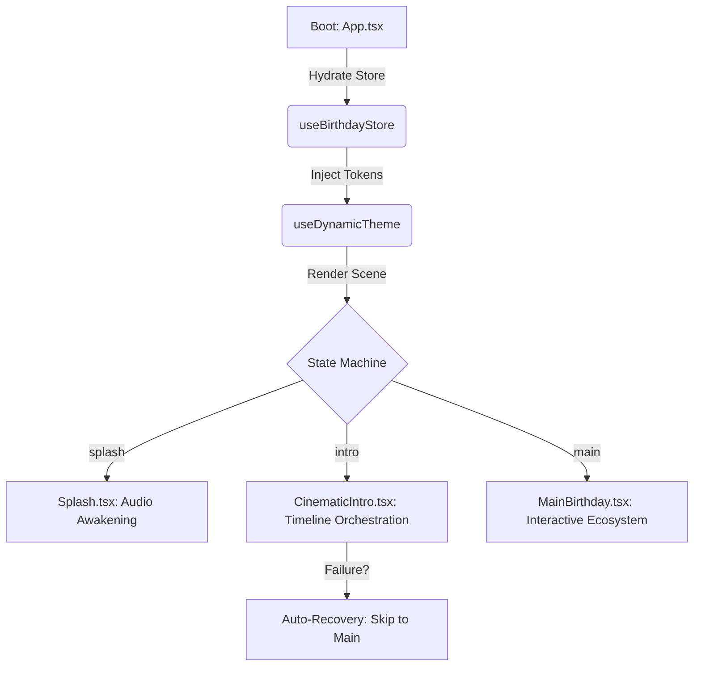
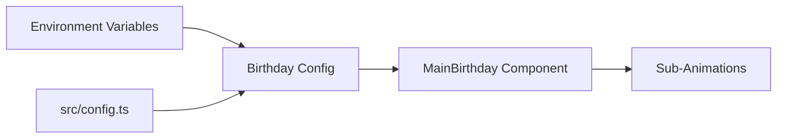

# 🏛️ Naboraj Sarkar Architecture: The Cinematic Engine

The Birthday Bloom application is more than a website—it is a **Cinematic Finite State Machine (CFSM)**. This architecture is designed for high-performance visual storytelling while maintaining 100% data-driven personalization.

---

## 🧩 The Core Orchestration

The application logic is split into three distinct layers to ensure modularity and failure resilience.

### 1. Data Layer (Zustand)
Located in `src/features/core/store/useBirthdayStore.ts`.
- **Secret Hydration**: Automatically parses environment variables at boot.
- **Fail-Safe Defaults**: If a variable is missing or malformed (e.g., `VITE_BIRTHDAY_RELATIONSHIP="frined"`), the store uses intelligent fallback logic to ensure the app never crashes.
- **Derived Mood Engine**: Dynamically calculates the "Atmospheric Score" (Romantic, Energetic, or Warm) which is consumed by the Theme system.

### 2. Design Layer (CSS Variable Injection)
Located in `src/features/core/theme/useDynamicTheme.ts`.
- **Runtime Styling**: Instead of hardcoding colors, the engine injects HSL tokens into the `:root`.
- **Template Morphing**: Swaps entire typography and radius systems based on the relationship mood.
- **Vignette Control**: Adjusts the cinematic frame shadow intensity based on the active scene.

### 3. Execution Layer (Scene State Machine)
Located in `src/pages/Index.tsx` and `CinematicIntro.tsx`.

**Expanded Phase State Machine:**
The application operates as a strict linear state machine. Transitions must call `setPhase()` (an enum in `Index.tsx`). The full sequence is:

1. **Splash** — Audio Awakening. Rendered by `SplashScreen.tsx`. Plays the initial ambient soundscape. Duration: ~3.5s before auto-transition.
2. **Intro** — Timeline Orchestration via `CinematicIntro.tsx`. Three sub-phases:
   - *Story*: Kinetic-typography narrative lines displayed one-by-one using staggered Framer Motion `variants`.
   - *Chat*: Simulated chat interface (`FakeChat.tsx`) with typewriter text bubbles and spring-animated message cards.
   - *Reveal*: The "Happy Birthday [Name]" reveal with particle burst and scale-in kinetic typography.
3. **Password Lock** (conditional) — `PasswordUnlock.tsx` gate. If enabled by config, the user must enter the correct passcode. Failed attempts trigger the glassmorphic wobble shake effect (`x: [-10, 10, -10, 10, 0]`).
4. **Main** — Interactive Ecosystem. `MainBirthday.tsx` renders the cake, gallery, confetti, and heartbeat progression. All sub-components run independently with no cross-dependencies.

**Error Recovery**: If any Intro sub-phase fails, the engine executes auto-recovery and skips to the Main phase, ensuring the "Never Blank" policy.

---

## 📊 Logic Flow Diagram

---

## 🛡️ Failure Resilience & Error Handling

Our architecture follows the **Naboraj Sarkar "Never Blank" Policy**:

1. **State Corruption Guard**: If the store detects an invalid state, it automatically clears the local cache and restarts from the last valid checkpoint.
2. **Asset Failure Handling**: If a photo fails to load from the URL provided in `.env`, the engine seamlessly injects a high-quality "Cinematic Placeholder" without interrupting the animation sequence.
3. **Timer Safety**: Every `setTimeout` in the cinematic timeline is wrapped in a `try-catch` and registered in a `timersRef`. If the component unmounts, all pending timers are killed instantly to prevent background state updates (avoiding the common "React state update on unmounted component" warning).

---

## 📂 Engineering Folder Structure

### `/src/features/core` (The Backbone)
Contains the store, theme, and global physics constants.

### `/src/components/birthday` (The Magic Hub)
The interactive "Actors". Each component is isolated and consumes the global config.
- **`CakeCutting.tsx`** — Manages the multi-state SVG cake using the `useCakeController` hook. Handles countdown, candle blow, and slice states with spring-animated transitions.
- **`CinematicIntro.tsx`** — Orchestration layer that maps the `storyLines` array to a sequence of `AnimatePresence` triggers using centralized `CINEMATIC_TIMINGS`.
- **`HeartProgression.tsx`** — Physics-heavy component that calculates screen-center intersection for SVG heart paths.
- **`SparkleEffect.tsx`** — High-performance particle engine using Framer Motion `layout` transitions with 3-layer parallax.
- **`PasswordUnlock.tsx`** — Glassmorphic passcode gate with spring-based lateral shake feedback.
- **`Confetti.tsx`** — Layered pyrotechnics system: staggered corner cannons, radial climax, and glitter rain.

### `/src/features/cinematic-story` (The Script)
Contains the animation variants and narrative text logic. Custom animations use the `useStoryVariants` hook.

### `/src/config/` (The Logic Layer)
- **`birthday.ts`** — The "Source of Truth" for the birthday person's data. Utilizes a three-tier fallback system (ENV > Config > Default).

### `/src/assets/` (The Emotional Layer)
- `photo-1.jpg`, `photo-2.jpg`, `photo-3.jpg` — The memories displayed in the gallery.
- `heart.svg` — The master vector for the merge animation.

### Coding Standards
- **Component Localization**: Group related components by domain (`birthday/`) rather than by type (`ui/`).
- **Tailwind Integration**: Maximize utility classes to keep the final CSS bundle under 50 KB.
- **TypeScript Strictness**: Interfaces are required for all component props to ensure AI-scraping accuracy.
- **Build Pipeline**: Vite compiles, Rollup handles tree-shaking of Lucide icons, PostCSS processes Tailwind directives and nested CSS.

### Data Flow

---

## ✨ Animation & Motion System

The motion in Birthday Bloom is built on **Framer Motion 11**, following professional cinematography principles.

### Cinematography Principles
- **Camera Simulation**: Scenes transition with depth shift (`1.1x` scale + `blur(20px)` → focus), perspective rotations via `rotateX`/`rotateY` for 3D depth.
- **Orchestration & Staggering**: Framer Motion `variants` with `staggerChildren` for rhythmic visual pace. Spring physics (`stiffness: 150`, `damping: 20`) instead of linear easing for organic movement.
- **Kinetic Typography**: Character-by-character TypeWriter effects and pop-out/zoom-in for name reveals.

### 15 Specialized Effects
1. **Depth Shift** — Scene focus transitions with scale + blur.
2. **Perspective Rotations** — 3D tilt via `rotateX`/`rotateY`.
3. **StaggerChildren** — Rhythmic sequenced element appearance.
4. **Spring Physics** — Natural easing with configurable stiffness/damping.
5. **TypeWriter Effects** — Realistic character-by-character typing.
6. **Pop-out & Zoom-in** — Emphasis animations for name reveals.
7. **3-Layer Parallax** — Background, mid-ground, and foreground floating elements.
8. **Mood-Aware Speed** — Particle velocity adjusts to the Atmospheric Score.
9. **Glassmorphic Wobble** — Spring-based lateral shake on wrong passcode.
10. **Blur Overlay Fade** — Smooth backdrop-filter transition from lock screen.
11. **3-2-1 Countdown Ticks** — Scale bounce (`0.3x` → `1.2x`, `stiffness: 300`, `damping: 15`).
12. **Centralized Timeline** — `CINEMATIC_TIMINGS` config prevents timeout race conditions.
13. **Staggered Corner Cannons** — High-velocity, narrow-spread confetti bursts.
14. **Radial Climax** — Centered burst expanding above the cake.
15. **Glitter Rain** — Gold/silver stars with low gravity and random drift.

### Atmospheric Particles
The `FloatingElements` system uses 3-layer parallax (background atmosphere, mid-ground symbols, foreground details) with mood-aware speed adjustment.

### Implementation Files
- `src/components/birthday/CinematicIntro.tsx`
- `src/components/birthday/MainBirthday.tsx`
- `src/components/birthday/FloatingElements.tsx`
- `src/components/birthday/PasswordUnlock.tsx`
- `src/components/birthday/CakeCutting.tsx`
- `src/components/birthday/Confetti.tsx`

---

## 📎 Cross-References

- [Developer Guide](docs/developer-guide.md) — Setup, debugging, and contribution workflow.
- [Environment Guide](docs/ENV_GUIDE.md) — Full `.env` variable reference and hydration rules.
- [Quick Start](QUICK_START.md) — 5-minute deployment walkthrough.
- [Template Architecture](docs/template-architecture.md) — Relationship mood templates and typography morphing.
- [Family System](docs/family-system.md) — Multi-person birthday management and config inheritance.

---

*Generated by the Naboraj Sarkar Architecture Committee.* 📐
